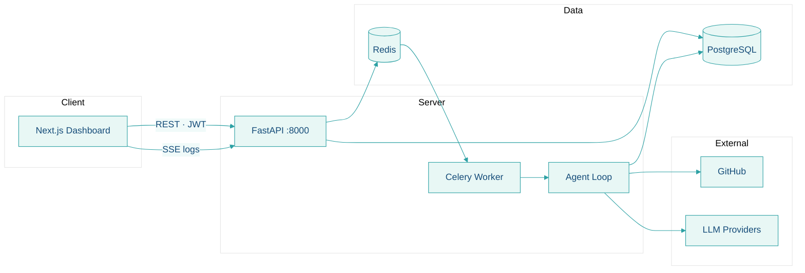

<div align="center">

<a href="https://github.com/imrrohitt/AutoPM">
  
</a>

<br />

### AI-native project management with autonomous coding agents

Plan work as **projects → stories → tickets**, connect **GitHub**, configure **LLMs**, and let agents **read your codebase, implement changes, and open pull requests** — with live logs and full RBAC.

<br />

[](https://www.python.org/)
[](https://nextjs.org/)
[](https://fastapi.tiangolo.com/)
[](https://www.postgresql.org/)
[](https://redis.io/)
[](https://github.com/imrrohitt/AutoPM)

<br />

[**Quick Start**](#quick-start) · [**Features**](#features) · [**Tech Stack**](#tech-stack) · [**Architecture**](#architecture) · [**API**](#api-reference) · [**Contributing**](#contributing)

<br />

| Dashboard | API | Agent |
|:---:|:---:|:---:|
| [`localhost:3000`](http://localhost:3000) | [`localhost:8000/docs`](http://localhost:8000/docs) | OpenHands-style loop + SSE |

</div>

<br />

---

## About

**AutoPM** is an open-source platform that unifies **project management** and **AI-powered implementation**. Teams get multi-tenant workspaces, role-based access, and a coding agent inspired by [OpenHands](https://github.com/OpenHands/OpenHands) — event log, rolling context condenser, secure tool loop, and GitHub PR workflow.

> **Local-first.** No Docker required. Run PostgreSQL and Redis on your machine, start the API, Celery worker, and Next.js dashboard.

---

## Features

<table>
<tr>
<td width="50%" valign="top">

### Plan & organize
- Multi-tenant **companies** and **projects**
- **Stories** with acceptance criteria & priorities
- **Tickets** with types, status, and comments
- **RBAC** — global + per-project roles

</td>
<td width="50%" valign="top">

### Build with AI
- **GitHub** — encrypted PAT, repo connect, codebase index
- **LLM** — Anthropic, Ollama, LiteLLM, OpenAI, Groq (per project)
- **Agent** — Celery jobs, **live SSE logs**, branch + PR
- **`AGENTS.md`** — auto-loaded skills from target repos

</td>
</tr>
</table>

| | Capability | Details |
|:---:|---|---|
| 🔐 | **Security** | Fernet-encrypted tokens & API keys; content validation before commit |
| 📡 | **Live workspace** | Story-level agent UI with run history and streaming progress |
| 🧠 | **Smart context** | Path scoring, repo tree, condenser, prior-run memory |
| 🛠️ | **Tool loop** | `read_file` → `write_file` → `finish` via GitHub API |

---

## Tech stack

<table>
<tr>
<td align="center" width="33%"><strong>Frontend</strong><br/><code>web/</code></td>
<td align="center" width="33%"><strong>Backend</strong><br/><code>modules/</code></td>
<td align="center" width="33%"><strong>Data & jobs</strong></td>
</tr>
<tr>
<td valign="top">

- [Next.js 14](https://nextjs.org/) App Router  
- [React 18](https://react.dev/) + [TypeScript](https://www.typescriptlang.org/)  
- [Tailwind CSS](https://tailwindcss.com/)  
- [Axios](https://axios-http.com/) + JWT refresh  
- [Sonner](https://sonner.emilkowal.ski/) toasts  

</td>
<td valign="top">

- [FastAPI](https://fastapi.tiangolo.com/) async API  
- [SQLAlchemy 2](https://www.sqlalchemy.org/) + [Alembic](https://alembic.sqlalchemy.org/)  
- [Pydantic](https://docs.pydantic.dev/) settings  
- [python-jose](https://python-jose.readthedocs.io/) JWT  
- [cryptography](https://cryptography.io/) Fernet  

</td>
<td valign="top">

- [PostgreSQL 15+](https://www.postgresql.org/)  
- [Redis](https://redis.io/) + [Celery](https://docs.celeryq.dev/)  
- [Anthropic](https://www.anthropic.com/) / Ollama / LiteLLM  
- GitHub API + MCP  

</td>
</tr>
</table>

---

## Architecture



| Layer | Role |
|-------|------|
| **Web** | Auth, projects, stories, tickets, settings, agent workspace |
| **API** | REST, RBAC, encryption, GitHub/LLM config, orchestration |
| **Worker** | Long-running agent runs, tools, PR workflow |
| **Agent** | Context, condenser, security analyzer, memory |

---

## Quick start

### Prerequisites

| Tool | Version |
|------|---------|
| Python | 3.11+ |
| Node.js | 18+ |
| PostgreSQL | 15+ |
| Redis | 6+ |

```bash
# macOS example
brew install postgresql@15 redis
brew services start postgresql@15 && brew services start redis
createdb autopm
```

### Install & run

```bash
# 1 — Clone
git clone https://github.com/imrrohitt/AutoPM.git
cd AutoPM
cp .env.example .env

# 2 — Generate encryption key (add to .env)
python -c "from cryptography.fernet import Fernet; print(Fernet.generate_key().decode())"

# 3 — Backend
python -m venv .venv && source .venv/bin/activate
pip install -r requirements.txt
alembic upgrade head
python seed.py                    # optional: admin@autopm.com / changeme123
./scripts/dev-backend.sh          # → http://localhost:8000

# 4 — Celery (required for agents + scheduled story AI runs)
./scripts/dev-celery.sh          # workers + beat in one process group

# 5 — Frontend
cd web && npm install && npm run dev   # → http://localhost:3000
```

<details>
<summary><strong>Seed defaults</strong></summary>

| Field | Value |
|-------|-------|
| Company | AutoPM (`autopm`) |
| Email | `admin@autopm.com` |
| Password | `changeme123` |

Override via `SEED_*` in `.env` — see [`.env.example`](.env.example).

</details>

### First-time flow

```
Register → Create project → Connect GitHub → Configure LLM → Stories & tickets → Run agent
```

1. Open **http://localhost:3000** and register (or use seed user).
2. Create a **project** with goals and tech stack for the agent.
3. **Settings → GitHub** — save PAT, connect repo, index codebase.
4. **Settings → LLM** — pick provider, test connection.
5. Add **stories** and **tickets** with acceptance criteria.
6. **Start AI work** — watch live logs in the agent workspace.

Add **`AGENTS.md`** to target repos so the agent follows your conventions.

---

## Development

| Command | Description |
|---------|-------------|
| `./scripts/dev-backend.sh` | FastAPI with hot reload (`:8000`) |
| `./scripts/dev-frontend.sh` | Next.js dev server (`:3000`) |
| `./scripts/dev-celery.sh` | Celery workers (`agent` prefork + `default` gevent) + beat (schedules) |
| `alembic upgrade head` | Apply database migrations |

---

<details>
<summary><strong>Environment variables</strong></summary>

### Root `.env`

| Variable | Description |
|----------|-------------|
| `DATABASE_URL` | `postgresql+asyncpg://user@localhost:5432/autopm` |
| `SECRET_KEY` | JWT signing secret |
| `ENCRYPTION_KEY` | Fernet key for GitHub & LLM secrets |
| `REDIS_URL` | Celery broker |
| `ANTHROPIC_API_KEY` | Optional global agent fallback |
| `GITHUB_MCP_SERVER_URL` | GitHub MCP endpoint |

### `web/.env.local`

```env
NEXT_PUBLIC_API_URL=http://localhost:8000
```

</details>

<details>
<summary><strong>API reference</strong></summary>

| Area | Coverage |
|------|----------|
| **Auth** | Register, login, refresh, `/auth/me` |
| **Projects** | CRUD, members, RBAC |
| **GitHub** | Token, repos, connect, index |
| **LLM** | Providers, save, test |
| **Stories / Tickets** | CRUD, comments, enable-agent |
| **Agent** | Run, logs, SSE stream, cancel |

Interactive docs → **http://localhost:8000/docs**

</details>

<details>
<summary><strong>RBAC</strong></summary>

**Global:** `owner` · `admin` · `member`

| Project role | Access |
|--------------|--------|
| **manager** | Stories, settings, members |
| **developer** | Tickets, run agent |
| **viewer** | Read-only |

Owners and admins bypass project-level restrictions.

</details>

<details>
<summary><strong>Agent system</strong></summary>

| Concept | Implementation |
|---------|----------------|
| Event log | Append-only actions & observations |
| Agent context | Repo skills + `AGENTS.md` |
| Rolling condenser | Compresses long histories |
| Tool loop | `read_file` → `write_file` → `finish` |
| Security analyzer | Blocks invalid content before commit |
| Memory | Prior run summaries |

See [`AGENTS.md`](./AGENTS.md) and [`modules/agent/AGENTS.md`](./modules/agent/AGENTS.md).

</details>

<details>
<summary><strong>Project structure</strong></summary>

```
AutoPM/
├── core/              # Config, DB, auth, encryption
├── modules/           # auth, users, projects, github, llm, stories, tickets, agent
├── migrations/        # Alembic
├── scripts/           # dev-backend, dev-frontend, dev-celery
├── docs/assets/       # Brand & README assets
├── main.py            # FastAPI entry
└── web/               # Next.js dashboard
```

</details>

<details>
<summary><strong>Troubleshooting</strong></summary>

| Problem | Solution |
|---------|----------|
| GitHub / LLM save fails | Set valid `ENCRYPTION_KEY` in `.env` |
| Agent stuck **queued** | Run `./scripts/dev-celery.sh` (only one worker). Kill strays: `pkill -9 -f modules.agent.celery_app`. Re-click **Start AI work** after 30s. |
| Agent errors | Configure project LLM or `ANTHROPIC_API_KEY`; verify GitHub PAT scopes |
| `401` responses | Re-login; check JWT / refresh token |
| DB errors | Verify `DATABASE_URL` and `createdb autopm` |

</details>

---

## Contributing

Contributions are welcome.

1. **Fork** the repo and create a feature branch.
2. Follow patterns in `modules/` and `web/`.
3. Run migrations if models change: `alembic revision --autogenerate -m "…"` then `alembic upgrade head`.
4. Test flows: projects → GitHub → LLM → agent.
5. Open a **pull request** with a clear description.

For agent changes, read [`modules/agent/AGENTS.md`](./modules/agent/AGENTS.md) first.

---

<div align="center">

<br />

**AutoPM** — project management and implementation in one place.

<br />


<br />

<sub>
  <a href="https://github.com/imrrohitt/AutoPM">GitHub</a> ·
  <a href="#quick-start">Quick Start</a> ·
  <a href="http://localhost:8000/docs">API Docs</a>
</sub>

<br />

<sub>Brand · Navy <code>#154c79</code> · Teal <code>#2da1a4</code> · Mint <code>#76d7c4</code></sub>

</div>
