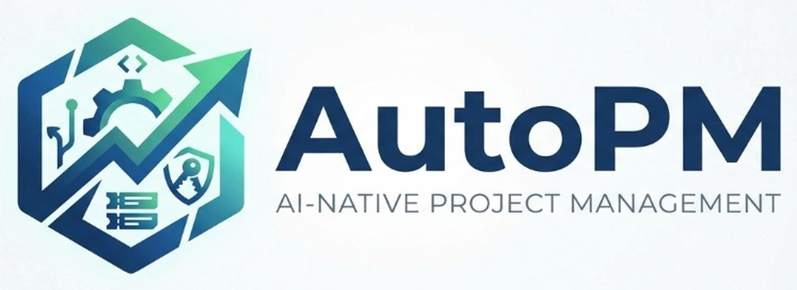
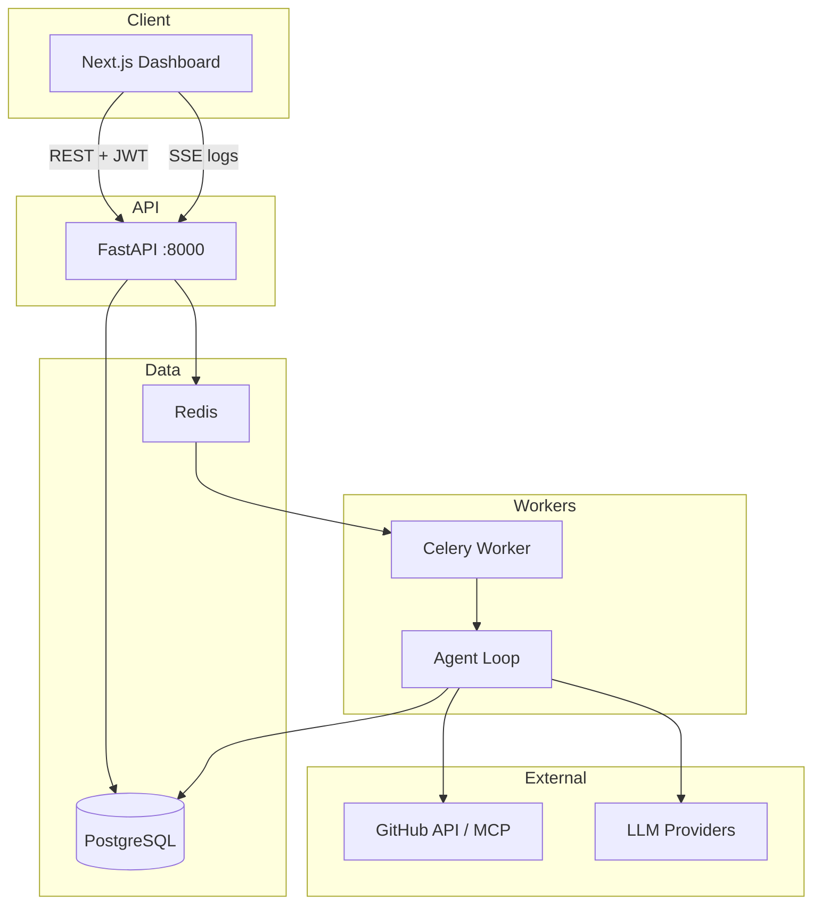

<br />

<p align="center">
  <a href="https://github.com/imrrohitt/AutoPM">
    
  </a>
</p>

<br />

<p align="center">
  <strong>Multi-tenant project management with autonomous coding agents that read your repo, implement work, and open pull requests.</strong>
</p>

<p align="center">
  <a href="#quick-start">Quick Start</a> ·
  <a href="#features">Features</a> ·
  <a href="#tech-stack">Tech Stack</a> ·
  <a href="#architecture">Architecture</a> ·
  <a href="#api-overview">API</a> ·
  <a href="#contributing">Contributing</a>
</p>

<p align="center">
  
  
  
  
  
  
</p>

---

## Overview

**AutoPM** is an open-source, AI-native project management platform. Teams organize work as **projects → stories → tickets**, connect **GitHub** repositories, configure **LLM providers** per project, and run an **autonomous coding agent** that follows an [OpenHands](https://github.com/OpenHands/OpenHands)-inspired loop: event log, rolling context condenser, tool use (`read_file` → `write_file` → `finish`), and security checks before commit.

Built for **local development** (no Docker required): PostgreSQL and Redis on your machine, FastAPI backend, Next.js dashboard, Celery workers for agent jobs.

| | |
|---|---|
| **Web UI** | [http://localhost:3000](http://localhost:3000) |
| **API docs** | [http://localhost:8000/docs](http://localhost:8000/docs) |
| **Agent pattern** | Event log · condenser · GitHub PR workflow |

---

## Table of contents

- [Features](#features)
- [Tech stack](#tech-stack)
- [Architecture](#architecture)
- [Prerequisites](#prerequisites)
- [Quick start](#quick-start)
- [Development scripts](#development-scripts)
- [First-time flow](#first-time-flow)
- [Environment variables](#environment-variables)
- [API overview](#api-overview)
- [RBAC](#rbac)
- [Agent system](#agent-system)
- [Project structure](#project-structure)
- [Troubleshooting](#troubleshooting)
- [Contributing](#contributing)

---

## Features

| Capability | Description |
|------------|-------------|
| **Multi-tenant workspaces** | Company-scoped users, projects, and settings |
| **RBAC** | Global roles (owner, admin, member) + per-project roles (manager, developer, viewer) |
| **Stories & tickets** | Priorities, statuses, acceptance criteria, comments |
| **GitHub integration** | PAT storage (encrypted), repo connect, codebase indexing |
| **LLM configuration** | Per-project provider: Anthropic, Ollama, LiteLLM, OpenAI, Groq |
| **Coding agent** | Queue runs via Celery; live log stream (SSE); branch + PR on success |
| **Agent workspace** | Story-level agent UI with run history and live progress |
| **Security** | Fernet encryption for tokens/keys; content validation before agent commits |
| **Target repo skills** | `AGENTS.md` at repo root loaded automatically on every agent run |

---

## Tech stack

### Frontend (`web/`)

| Technology | Version / notes |
|------------|-----------------|
| [Next.js](https://nextjs.org/) | 14 (App Router) |
| [React](https://react.dev/) | 18 |
| [TypeScript](https://www.typescriptlang.org/) | 5.7 |
| [Tailwind CSS](https://tailwindcss.com/) | 3.4 |
| [Axios](https://axios-http.com/) | API client + JWT refresh |
| [Sonner](https://sonner.emilkowal.ski/) | Toasts & feedback |
| [Lucide React](https://lucide.dev/) | Icons |

### Backend (repo root)

| Technology | Version / notes |
|------------|-----------------|
| [FastAPI](https://fastapi.tiangolo.com/) | Async REST API |
| [SQLAlchemy](https://www.sqlalchemy.org/) | 2.x async ORM |
| [Alembic](https://alembic.sqlalchemy.org/) | Migrations |
| [PostgreSQL](https://www.postgresql.org/) | 15+ via `asyncpg` |
| [Celery](https://docs.celeryq.dev/) | Agent job queue |
| [Redis](https://redis.io/) | Broker + result backend |
| [Pydantic](https://docs.pydantic.dev/) | Settings & schemas |
| [python-jose](https://python-jose.readthedocs.io/) | JWT auth |
| [cryptography](https://cryptography.io/) | Fernet encryption (GitHub PAT, LLM keys) |
| [Anthropic SDK](https://github.com/anthropics/anthropic-sdk-python) | Claude API |
| [httpx](https://www.python-httpx.org/) | LLM HTTP clients |

### AI & integrations

| Component | Role |
|-----------|------|
| **Anthropic Claude** | Primary cloud LLM (per-project or global key) |
| **Ollama** | Local models via `/api/generate` |
| **LiteLLM / OpenAI-compatible** | Proxy to many models |
| **OpenAI / Groq** | Optional cloud providers |
| **GitHub API + MCP** | Repo access, indexing, PR creation |
| **OpenHands-style agent** | `modules/agent/` — event log, condenser, tool loop |

### Infrastructure (local)

| Service | Purpose |
|---------|---------|
| **PostgreSQL** | Primary datastore |
| **Redis** | Celery broker (`/0`) and results (`/1`) |

---

## Architecture



| Layer | Responsibility |
|-------|----------------|
| **Web** | Auth, projects, stories, tickets, settings, agent workspace |
| **API** | REST, RBAC, encryption, GitHub/LLM config, agent orchestration |
| **Worker** | Long-running agent runs, tool execution, PR workflow |
| **Agent** | Context building, path scoring, file read/write, finish + security analyzer |

---

## Prerequisites

| Requirement | Version |
|-------------|---------|
| Python | 3.11+ |
| Node.js | 18+ |
| PostgreSQL | 15+ |
| Redis | 6+ |

**macOS (Homebrew) example:**

```bash
brew install postgresql@15 redis
brew services start postgresql@15
brew services start redis
createdb autopm
```

---

## Quick start

### 1. Clone & configure

```bash
git clone https://github.com/YOUR_ORG/AutoPM.git
cd AutoPM
cp .env.example .env
# Set DATABASE_URL, SECRET_KEY, ENCRYPTION_KEY (see Environment variables)
```

Generate a Fernet encryption key:

```bash
python -c "from cryptography.fernet import Fernet; print(Fernet.generate_key().decode())"
```

### 2. Database & API

```bash
python -m venv .venv
source .venv/bin/activate
pip install -r requirements.txt
alembic upgrade head
python seed.py          # optional: default company + owner
./scripts/dev-backend.sh
```

API runs at **http://localhost:8000** · OpenAPI at **http://localhost:8000/docs**

### 3. Celery worker (required for agents)

```bash
source .venv/bin/activate
./scripts/dev-celery.sh
```

### 4. Web app

```bash
cd web
cp .env.local.example .env.local   # if present
npm install
npm run dev
```

Open **http://localhost:3000**

---

## Development scripts

| Script | Description |
|--------|-------------|
| `./scripts/dev-backend.sh` | FastAPI with hot reload (`:8000`) |
| `./scripts/dev-frontend.sh` | Next.js dev server (`:3000`) |
| `./scripts/dev-celery.sh` | Celery worker for agent jobs |
| `python seed.py` | Seed company + owner user |
| `alembic upgrade head` | Apply DB migrations |

### Seed defaults

| Field | Default |
|-------|---------|
| Company | AutoPM (`autopm`) |
| Email | `admin@autopm.com` |
| Password | `changeme123` |

Override with `SEED_*` variables in `.env` (see `.env.example`).

---

## First-time flow

1. **Register** at `/register` — creates company + owner account (or use seed user).
2. **Create a project** — `/projects/new` with goals and tech stack for the agent.
3. **Connect GitHub** — project settings → save PAT → list repos → connect repository → index codebase.
4. **Configure LLM** — project settings → choose provider (Anthropic, Ollama, LiteLLM, etc.) → test connection.
5. **Create stories & tickets** — define work with acceptance criteria.
6. **Run the agent** — story page → **Start AI work** or ticket-level agent → watch **live logs** in the agent workspace.

For target repositories (e.g. your app repo), add an **`AGENTS.md`** at the root with coding conventions; AutoPM loads it on every agent run.

---

## Environment variables

### Root `.env`

| Variable | Description |
|----------|-------------|
| `DATABASE_URL` | `postgresql+asyncpg://user@localhost:5432/autopm` |
| `SECRET_KEY` | JWT signing secret |
| `ENCRYPTION_KEY` | Fernet key for GitHub tokens & LLM API keys |
| `REDIS_URL` / `CELERY_BROKER_URL` | Redis for Celery |
| `ANTHROPIC_API_KEY` | Optional global fallback for the agent |
| `GITHUB_MCP_SERVER_URL` | GitHub MCP endpoint for agent tools |
| `SEED_*` | Optional seed script overrides |

### `web/.env.local`

```env
NEXT_PUBLIC_API_URL=http://localhost:8000
```

---

## API overview

| Area | Endpoints (summary) |
|------|---------------------|
| **Auth** | Register, login, refresh, logout, `/auth/me` |
| **Company & users** | Company profile, invite users, role updates |
| **Projects** | CRUD, members, RBAC |
| **GitHub** | Token, list repos, connect, disconnect, index |
| **LLM** | List providers, save/test per-project config |
| **Stories** | CRUD under `/projects/{id}/stories` |
| **Tickets** | CRUD, comments, enable-agent |
| **Agent** | Run story/ticket, list runs, logs, SSE stream, cancel |

Interactive docs: **http://localhost:8000/docs**

---

## RBAC

### Global roles

| Role | Typical access |
|------|----------------|
| **owner** | Full company control |
| **admin** | Manage users and projects |
| **member** | Project access via membership |

### Project roles

| Role | Permissions |
|------|-------------|
| **manager** | Stories, settings, members |
| **developer** | Tickets, run agent |
| **viewer** | Read-only |

Global **owner** / **admin** bypass project checks for create/agent actions.

---

## Agent system

The coding agent in `modules/agent/` implements:

| Concept | Implementation |
|---------|----------------|
| **Event log** | Append-only actions & observations each step |
| **Agent context** | Repo skills + triggered knowledge from `AGENTS.md` |
| **Rolling condenser** | Compresses history when context grows |
| **Tool loop** | `read_file` → `write_file` → `finish` (GitHub API) |
| **Security analyzer** | Blocks invalid or placeholder file content before commit |
| **Memory** | Prior run summaries for continuity |

See [`AGENTS.md`](./AGENTS.md) (repo root) and [`modules/agent/AGENTS.md`](./modules/agent/AGENTS.md) for agent authoring rules.

---

## Project structure

```
AutoPM/
├── core/                 # Config, database, auth, encryption
├── modules/
│   ├── auth/             # Registration, JWT
│   ├── users/            # Company users
│   ├── projects/         # Projects & members
│   ├── github/           # GitHub connection & indexing
│   ├── llm/              # Per-project LLM providers
│   ├── stories/          # Stories
│   ├── tickets/          # Tickets & comments
│   └── agent/            # Celery tasks, loop, tools, SSE
├── migrations/           # Alembic revisions
├── scripts/              # dev-backend, dev-frontend, dev-celery
├── docs/assets/          # README logo & assets
├── main.py               # FastAPI entrypoint
├── seed.py               # Database seed
└── web/                  # Next.js App Router UI
    ├── app/              # Routes (dashboard, auth, agent workspace)
    ├── components/       # UI, layout, agent panels
    ├── lib/              # API client, hooks, types
    └── public/           # Static assets (favicon, logo)
```

---

## Troubleshooting

| Issue | Fix |
|-------|-----|
| GitHub / LLM save fails | Set a valid `ENCRYPTION_KEY` in `.env` |
| Agent stays **queued** | Start Redis and `./scripts/dev-celery.sh` |
| Agent errors immediately | Configure project LLM or set `ANTHROPIC_API_KEY`; connect GitHub with a PAT that has repo access |
| 401 on API | Check JWT / refresh token; re-login |
| DB connection errors | Verify `DATABASE_URL` and that `autopm` database exists |

---

## Contributing

Contributions are welcome. To get started:

1. Fork the repository and create a feature branch.
2. Follow existing patterns in `modules/` and `web/`.
3. Run migrations if you change models: `alembic revision --autogenerate -m "description"` then `alembic upgrade head`.
4. Test API (`/docs`) and UI flows (projects → GitHub → LLM → agent).
5. Open a pull request with a clear description and screenshots when UI changes.

For agent behavior changes, read **`modules/agent/AGENTS.md`** before submitting.

---

<p align="center">
  <sub>Built with care for teams who want PM and implementation in one place.</sub><br />
  <sub>Brand colors: Navy <code>#154c79</code> · Teal <code>#2da1a4</code> · Mint <code>#76d7c4</code></sub>
</p>
